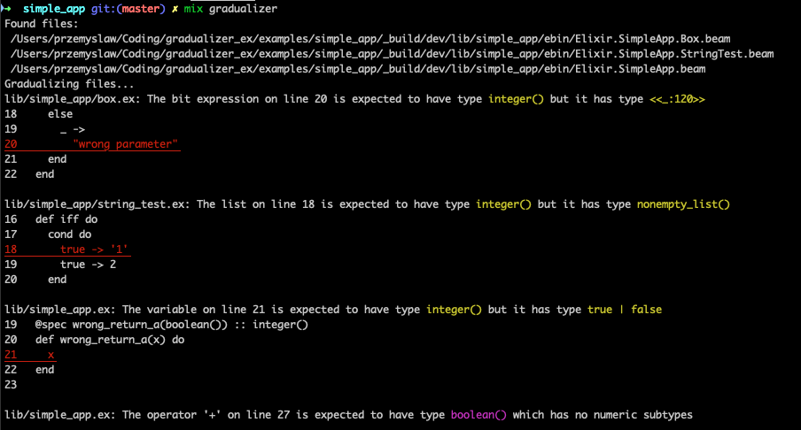

# Gradient

[](https://github.com/esl/gradient/actions/workflows/build-and-test.yml)

Gradient is a [gradual typechecker][siek:what-is-gt] for Elixir.

Gradual typing is a bit like static typing,
because it provides error messages if your code has types and specs - and any errors, obviously.
Gradual typing is also a bit like dynamic typing,
because it doesn't require all the functions to have specs and just agrees when you say:
"Trust me, I'm a (software) engineer!" 

[siek:what-is-gt]: https://wphomes.soic.indiana.edu/jsiek/what-is-gradual-typing/

Gradient relies on [Gradualizer](https://github.com/josefs/Gradualizer) as the actual typechecker,
but aims to make jumping the hoops between your Elixir code and the Erlang abstract
syntax tree that Gradualizer works on effortless.


## Usage

Gradient can be installed by adding `gradient` to your list of dependencies in `mix.exs`:

```elixir
def deps do
  [
    {:gradient, github: "esl/gradient"}
  ]
end
```

Gradient comes with a Mix task that runs the typechecker on an Elixir project:

```
mix gradient
```

And presents errors in Elixir syntax:



The `examples/` folder contains example applications showing how the produced error messages look like.


## Caveats

**Gradient is experimental!** Please use it and let us know how it feels.
We're especially looking for code snippets where it doesn't work the way you'd expect it to,
together with an explanation of what's happening and what's expected.
Together, we can make it robust and convenient to work with,
so that we all feel more productive!
